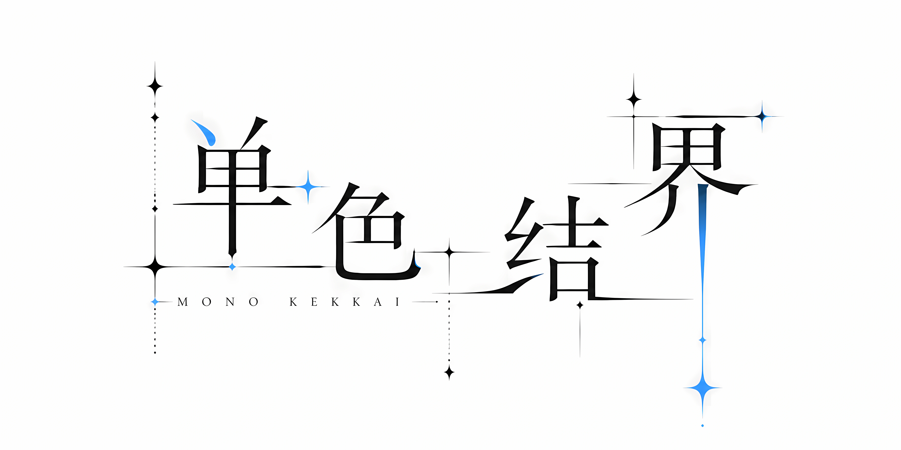

<!--
  单色结界 / MONO KEKKAI
  万色合一的起点，跨越幻想与科学的单色结界。
-->

&emsp;

万色合一的起点，跨越幻想与科学的单色结界。

&emsp;

> **关上门，拉上窗帘。**
>
> 一个人，一张桌子，一台电脑。
>
> **万物在此，皆为单色。**
>
> 这是我的「领域」。
>
> 我在此，为幻想，为科学，为创造，展开单色的结界。

 

---

## 欢迎进入单色结界

在结界之内，你会看到一些东西。它们来自同一个源头，但抵达了不同的终点。

有些是代码，有些是实物，有些是文字，有些是声音。形式从不定义它们，定义它们的是内在的法则。

每一个作品，都是一套自洽的系统，有自己的边界、逻辑，和必须遵循的规律。

你可以拿起它，检验它，甚至质疑它。但它会在那里，以它自己的方式运转。

它们不是为了被所有人看到而存在的。它们是为了被完成而存在的。漫长的、独自的、反复推敲的过程，最终凝结成一件可交付的成品。过程是结界之内的事，成品是递给结界之外的手。

至于为什么做这些？答案可能很简单：

> **我想看到它们，而它们还没有人做。**

---

_社团正在初期筹备中，公开作品将陆续发布。_

 

Metadata

<b>GPG Fingerprint</b>&emsp;2CD6 1B3A CE8F C887 423A 4782 D473 076F D48E 9A1B

<b>License</b>&emsp;MIT License

<b>Mail</b>&emsp;vvvvirga@gmail.com

